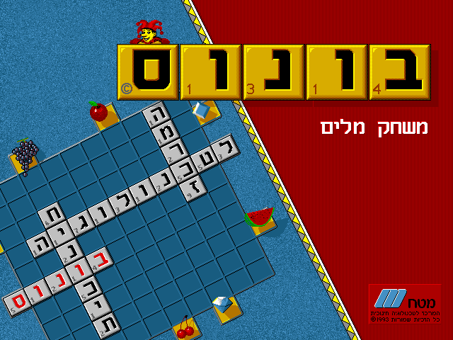
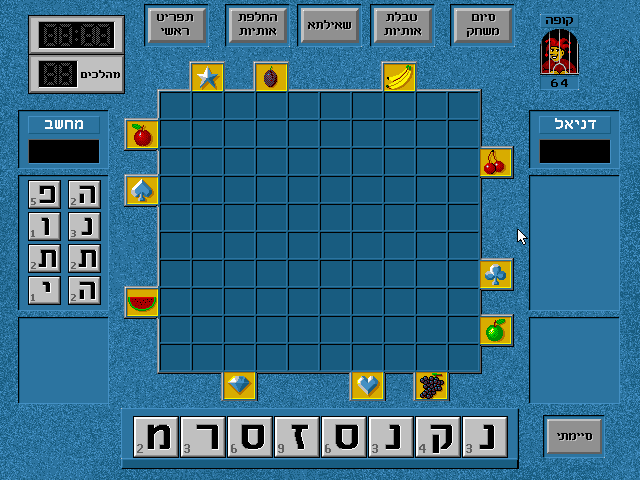

This is a story about how one seemingly-small idea led me down the deepest rabbit hole of my life.

First, let me introduce you to Bonus.

Bonus is an Israeli educational DOS game from 1993, created by , an NPO which has created many educational games for the Israeli education system.
The game is based on the word game [Scrabble](https://en.wikipedia.org/wiki/Scrabble), with some minor differences.

It has seen popularity, mostly in 90s and early 2000s, as it was commonly installed on PCs in computer labs of elementary schools, and was later made available to download from a popular site dedicated to old games.

A few years ago I got the brilliant idea of modifying the game's internal dictionary, perhaps adding some modern terms and just learning how its internal system worked.  
Trying to explain why this dictionary is interesting takes a bit of exposition, so bear with me.

Without getting too much [into the weeds](https://en.wikipedia.org/wiki/Modern_Hebrew_grammar), the game accepts not only nouns, adjectives and verbs, but also different types of verb conjugations and noun inflections.
It accepts adpositions, such as "ב-" (used like the locative prefix "in") or "ל-" (used as an infinitive marker, "to write", or a preposition like "for you" or "to me").
It also accepts verbs of different time tenses, both masculine and feminine forms and [grammatical person](https://en.wikipedia.org/wiki/Grammatical_person) (e.g: first, second and third person), which in Hebrew may change the spelling of the verb in irregular ways.

Just as an example, in the case of a single verb in Hebrew, where it may be in one of a few stems (or "structures"/"constructions"), and may have:
- 2 gender forms (masculine/feminine);
- for each of 2 count forms (singular/plural);
- for each of 3 time forms (past/present/future) and 3 additional forms (imperative, an affirmative command, "write!"; infinitive, "to write"; action noun, "writing(s)").

A total of as many as 24 different ways to conjugate and spell one verb. And that's just one part of it. I'm entirely omitting additional cases, like active and passive voices.
There are rules and common structures for most cases, but there are also many irregularities and exceptions.

Considering all of the above, one would expect a [combinatorial explosion](https://en.wikipedia.org/wiki/Combinatorial_explosion), which would lead to a very large dictionary file and therefore some clever
tricks for encoding or compressing everything, or a very complicated grammatical engine that can cover all that.

## How and why it took so long

I've been working on this project on and (mostly) off since at least mid-2020, possibly even 2019.

This project proved a significant challenge, given my lack of reversing experience, very limited knowledge of 16-bit DOS-era programming (like understanding the [x86 segmented memory model](https://en.wikipedia.org/wiki/X86_memory_segmentation)), and short supply of written guides on this specific topic of reverse engineering.

Additionally, the game itself had a few defenses mounted that made both static analysis (i.e. opening with Ghidra or IDA Pro 5) and dynamic analysis (i.e. debugging with DosBox) difficult.

The first obstacle I encountered was the game's custom copy protection mechanism, which to this day I haven't completely reversed (however, since the game can be found online with a crack, it can be bypassed). 
One of the techniques employed by this mechanism is having the actual entry function of the game encrypted, such that opening the unmodified executable in Ghidra would have the entry function be the copy protection functionality.

It took a bit of research, but this was eventually just sidestepped completely by working on a memory dump of the game at the entry point _after_ the copy protection decoded the real code.

However, the hardest challenge was the game's use of [overlays](https://en.wikipedia.org/wiki/Overlay_(programming)), which will be the topic of the next post in this series.

Even before I knew what it was, trying to debug the game was a very confusing ordeal. Stepping through functions that I could find with Ghidra would occasionally call or jump to different parts in memory and return to an address that
previously held a completely different function just moments ago.  
I could see the same issue when looking at memory dumps of the game from different points in time. Entire functions were gone and replaced with different ones.

Every time I thought I had a new idea to gain new insight, about once every several months, I'd give it a shot only to eventually run into that same issue which confounded me for so long.

My attempts went as far as trying to get different debuggers working with DosBox and even trying to build a tool that would allow me to dump all state emulated by DosBox over some period of time and let me scrub over that timeline to 
see how CPU registers and memory changed over time.

The final breakthrough came once I learned of the overlay system used by the game, Borland's VROOMM overlay manager, and finding this brilliant piece of work: [DEVROOMM by Nancy Aurum](https://github.com/NancyAurum/devroomm). 
This is a decompilation of that overlay manager, which helped me finally understand how it worked and why I was seeing the CPU jumping all over the place.

Once I understood everything, I could write a Ghidra script that would finally give me a proper executable that can be statically analyzed, and I've been reversing it ever since (aside from [one long break](https://factorio.com/space-age/content)).

The next post in this series will cover the process described above in more detail.

## What was achieved

Once static analysis was possible, the following things were reversed successfully:

- Most of the game's dictionary, its different files and how each is used (a few bits of information are still unclear).
- The game's different image and font asset files.
- A fair portion of the game was so far annotated in Ghidra.

I have also written code to read and extract the words of the game's dictionary, and read and extract the game's assets.  
Pattern files for the wonderful [ImHex hex editor](https://github.com/WerWolv/ImHex) were also produced for the different file types.

The code for the above will be available.

I will not, however, make the Ghidra project for the game publicly available, as the game is likely still under copyright.

## Next up

In each of the following posts, I will go into detail into these topics:

1. Getting to static analysis of the game.
1. Reversing the dictionary.
1. Reversing the game assets.

Stay tuned!
